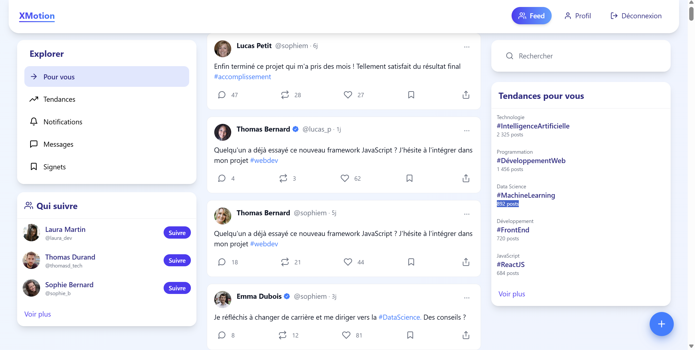

# 

## Description
XMotion est une application web développée en groupe pour le HACKATHON 2025 de l'école IPSSI. Elle permet aux utilisateurs de publier des posts, d'interagir avec eux (likes, retweets, réponses), de rechercher des posts et des utilisateurs, et de voir les tendances actuelles. En plus de ces fonctionnalités, les utilisateurs peuvent suivre d'autres utilisateurs et voir la liste de leurs abonnements et abonnés. L'application comprend un backend construit avec Node.js, Express et MongoDB, ainsi qu'un frontend développé avec React, Tailwind et Vite.



## Table des matières
- [Technologies utilisées](#technologies-utilisées)
- [Installation](#installation)
- [Configuration](#configuration)
- [Démarrage](#démarrage)
- [API Endpoints](#api-endpoints)
- [WebSockets](#websockets)
- [Frontend](#frontend)
- [Contribuer](#contribuer)
- [Licence](#licence)

## Technologies utilisées
### Backend
- Node.js
- Express
- MongoDB
- TypeScript

### Frontend
- React
- Vite
- Tailwind
- TypeScript

## Installation
1. Clonez le dépôt :
    ```bash
    git clone https://github.com/MatisAgr/IPSSI_HACKATHON_2025.git
    cd hackathon-2025
    ```

2. Installez les dépendances pour le backend et le frontend :
    ```bash
    cd back
    npm install
    cd ../front
    npm install
    ```

## Configuration
1. Backend : Créez un fichier `.env` dans le dossier `back` et ajoutez les variables d'environnement suivantes :
    ```env
    PORT=5000
    MONGO_URI=votre_mongo_uri
    JWT_SECRET=votre_secret_jwt
    ```

2. Frontend : Créez un fichier `.env` dans le dossier `front` en vous basant sur `.env.example`.

## Démarrage
1. Démarrez le serveur backend en mode développement :
    ```bash
    cd back
    npm run dev
    ```

2. Démarrez le serveur frontend en mode développement :
    ```bash
    cd front
    npm run dev
    ```

## API Endpoints
Les routes API sont définies dans le dossier `routes` du backend. Elles couvrent les fonctionnalités suivantes :
- Utilisateurs
- Posts
- Interactions (likes, retweets, réponses)
- Recherche
- Tendances

## WebSockets
Le projet utilise les WebSockets pour les notifications en temps réel. Les WebSockets sont gérés dans le backend et permettent de notifier les utilisateurs des nouvelles interactions (likes, retweets, réponses) en temps réel.

## Frontend
Le frontend de l'application est développé avec React, Vite et Tailwind. Il communique avec le backend via les API REST et affiche les données récupérées. Les principales fonctionnalités incluent :
- **Authentification** : Les utilisateurs doivent s'inscrire ou se connecter pour accéder à l'application.
- **Affichage des posts et des interactions** : Les utilisateurs peuvent voir les posts, les liker, les retweeter et y répondre.
- **Recherche avancée de posts et d'utilisateurs** : Les utilisateurs peuvent rechercher des posts par mots-clés, hashtags, date et popularité.
- **Affichage des tendances actuelles** : Les utilisateurs peuvent voir les hashtags et les posts les plus populaires.
- **Notifications en temps réel** : Les utilisateurs reçoivent des notifications en temps réel pour les nouvelles interactions grâce aux WebSockets.
- **Profil utilisateur** : Les utilisateurs peuvent voir et éditer leur profil, ainsi que voir les profils des autres utilisateurs.
- **Interface utilisateur réactive** : Utilisation de Tailwind pour un design moderne et réactif.


